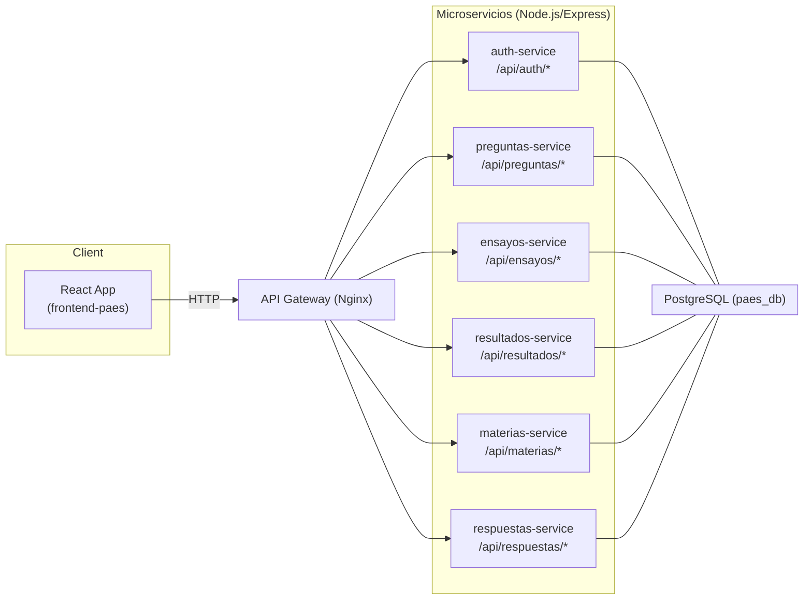
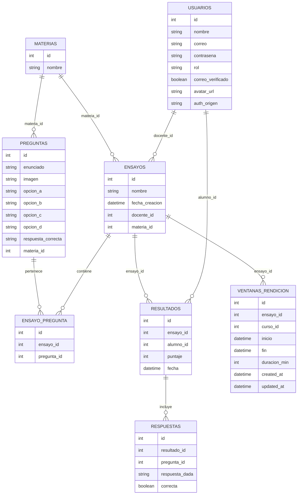

# Plataforma PAES — Documentación Técnica

## 1. Introducción técnica
**Arquitectura:** plataforma web basada en **microservicios (Node.js + Express)**, un **API Gateway (Nginx)**, **PostgreSQL** como base de datos y **React** como frontend. La orquestación local es con **Docker Compose**.  
**Propósito:** describir la arquitectura y decisiones técnicas del sistema **PAES**.

---

## 2. Arquitectura del sistema

### 2.1 Diagrama de alto nivel



### 2.2 Descripción de componentes
- **API Gateway (Nginx)**
  - Reverse proxy y CORS a nivel gateway. Reenvía `Authorization` y `Cookie` a los servicios.
  - Ruteo: `/api/{servicio}/` → `{servicio}-service:{puerto}` (ver `gateway/nginx.conf`).
- **Microservicios (Node.js + Express)**
  - **auth-service:** registro/login local, Google OAuth, emisión de JWT.
  - **preguntas-service:** CRUD de preguntas por materia.
  - **ensayos-service:** creación/gestión de ensayos y relación con preguntas.
  - **resultados-service:** resultados, respuestas por ensayo, vistas de docente/alumno.
  - **materias-service:** catálogo de materias.
  - **respuestas-service:** (si aplica) endpoints de respuestas.
- **Base de datos (PostgreSQL)**
  - Esquema centralizado `paes_db`, compartido por los servicios (ver `db/01_schema.sql`).
- **Frontend (React)**
  - SPA que consume `/api/*` vía gateway. Maneja roles (alumno/docente/admin) y vistas (crear ensayos, ver resultados, etc.).

### 2.3 Patrones usados
- **Microservicios**, **REST API**, comunicación **HTTP**.
- **JWT** para autenticación, **RBAC** (roles: `alumno`, `docente`, `admin`).
- Validación/normalización de inputs en los handlers.
- **Docker** para portabilidad y orquestación.

> **Nota de puertos:** aunque `docker compose ps` muestre `5000/tcp`, cada servicio expone su puerto por variable `PORT` (5001–5006). Nginx enruta a los **puertos correctos** declarados en `nginx.conf`:
auth→5001, preguntas→5002, ensayos→5003, resultados→5004, materias→5005, respuestas→5006.

---

## 3. Detalle por servicio

| Campo | Auth Service | Preguntas Service | Ensayos Service | Resultados Service | Materias Service | Respuestas Service |
|---|---|---|---|---|---|---|
| **Responsabilidad** | Registro/login, Google OAuth, emisión de JWT | CRUD preguntas, filtrado por materia/búsqueda | Crear ensayos, asociar preguntas, listar, ventanas | Listar resultados (alumno/docente), detalle por resultado, responder/finalizar | Listado/gestión de materias | (Si aplica) gestión de respuestas |
| **Tecnologías** | Node.js, Express, PostgreSQL, JWT, bcrypt | Node.js, Express, PostgreSQL | Node.js, Express, PostgreSQL | Node.js, Express, PostgreSQL | Node.js, Express, PostgreSQL | Node.js, Express, PostgreSQL |
| **Endpoints principales** | `/api/auth/login`, `/api/auth/registro`, `/api/auth/oauth/google/*`, `/api/auth/me` | `POST /api/preguntas/crear-pregunta`, `GET /api/preguntas/`, `PUT /api/preguntas/:id`, `DELETE /api/preguntas/eliminar-pregunta/:id` | `POST /api/ensayos/crear-ensayo`, `POST /api/ensayos/crear-ensayo-con-preguntas`, `GET /api/ensayos/ver-ensayos`, `GET /api/ensayos/listar-todos`, `GET /api/ensayos/:ensayo_id/preguntas`, `POST /api/ensayos/:ensayo_id/ventanas` | `GET/POST /api/resultados/ver-resultados`, `GET/POST /api/resultados/ver-detalle-resultado`, `POST /api/resultados/crear-resultado`, `GET /api/resultados/:resultado_id/preguntas-ensayo`, `POST /api/resultados/:resultado_id/responder`, `POST /api/resultados/:resultado_id/finalizar`, `GET/POST /api/resultados/ver-resultados-docente` | `/api/materias/` | `/api/respuestas/` |
| **Datos que maneja** | usuarios (id, nombre, correo, contrasena*, rol, oauth) | preguntas (enunciado, opciones, correcta, materia_id) | ensayos (nombre, docente_id, materia_id) + `ensayo_pregunta` | resultados, respuestas por resultado/pregunta | materias (id, nombre) | respuestas (si se desacopla del módulo resultados) |
| **Dependencias** | DB usuarios, JWT, Google OIDC | DB preguntas/materias | DB ensayos/preguntas | DB ensayos/preguntas/resultados/respuestas/usuarios | DB materias | DB respuestas/resultados |
| **Errores típicos** | 400 credenciales inválidas, 409 correo duplicado, 401 token inválido | 400 validación, 404 no encontrado, 500 DB | 400 payload inválido, 403 rol, 500 DB | 400/403/404 reglas de acceso y filtros, 500 DB | 500 DB | 400/500 varios |

\* contraseñas hasheadas con **bcrypt** (`auth.js`).

---

## 4. Modelos de datos

### 4.1 Diagrama ER (resumen)



### 4.2 Políticas de integridad, índices y migraciones
- **FK con `ON DELETE CASCADE`** para mantener consistencia (ensayos, preguntas, resultados, respuestas).
- Índices únicos: `usuarios.correo`, `materias.nombre`, `(ensayo_id, pregunta_id)` en `ensayo_pregunta`, `(resultado_id, pregunta_id)` en `respuestas`.
- Migraciones: inicialización con scripts en `db/` (e.g., `01_schema.sql`) vía **Docker init**. Para cambios: versionar archivos SQL (o introducir `node-pg-migrate`).

### 4.3 Backup/restore
- **Backup:** `pg_dump -h localhost -p 5433 -U user -d paes_db > backup.sql`  
- **Restore:** `psql -h localhost -p 5433 -U user -d paes_db < backup.sql`

---

## 5. APIs (contratos de servicio)

> Las URLs están **por gateway**. Internamente los servicios montan rutas base simples y Nginx las expone bajo `/api/{servicio}/...`.

### 5.1 Auth
- **POST** `/api/auth/registro`  
  **Body**
  ```json
  { "nombre":"Ana", "correo":"ana@test.com", "contrasena":"secreto", "rol":"alumno" }
  ```
  **201**
  ```json
  { "mensaje":"Usuario registrado exitosamente", "usuario": { "id":1, "nombre":"Ana", "correo":"ana@test.com", "rol":"alumno" } }
  ```

- **POST** `/api/auth/login`  
  **Body**
  ```json
  { "correo":"ana@test.com", "contrasena":"secreto" }
  ```
  **200**
  ```json
  { "token":"JWT...", "usuario": { "id":1, "nombre":"Ana", "correo":"ana@test.com", "rol":"alumno" } }
  ```

- **GET** `/api/auth/oauth/google/start` → redirección a Google  
- **GET** `/api/auth/oauth/google/callback` → emite token final o temp onboarding.

### 5.2 Preguntas
- **POST** `/api/preguntas/crear-pregunta` (docente/admin)  
  **Body**
  ```json
  {
    "enunciado":"¿2+2?",
    "opcion_a":"1","opcion_b":"2","opcion_c":"3","opcion_d":"4",
    "respuesta_correcta":"D","materia_id":1, "imagen": null
  }
  ```
  **201**: pregunta creada.

- **GET** `/api/preguntas/?materia_id=1&busqueda=suma`  
  **200**: `[ { "id":..., "enunciado":"...", ... } ]`

- **PUT** `/api/preguntas/:id` (docente/admin)  
- **DELETE** `/api/preguntas/eliminar-pregunta/:id` (docente/admin)

### 5.3 Ensayos
- **POST** `/api/ensayos/crear-ensayo` (docente/admin)  
  **Body mínimo**
  ```json
  { "titulo":"Ensayo 1", "materia_id":1 }
  ```
  (El backend mapea `titulo|nombre`, usa `docente_id` del JWT)

- **POST** `/api/ensayos/crear-ensayo-con-preguntas` (docente/admin)  
  **Body**
  ```json
  { "titulo":"Ensayo 1", "materia_id":1, "preguntas":[101,102,103] }
  ```
  **201**
  ```json
  { "mensaje":"Ensayo creado con preguntas asociadas", "ensayo": { "id": 10, "nombre": "Ensayo 1" } }
  ```

- **GET** `/api/ensayos/ver-ensayos?materia_id=1`  
- **GET** `/api/ensayos/listar-todos`  
- **GET** `/api/ensayos/:ensayo_id/preguntas`

### 5.4 Resultados
- **GET/POST** `/api/resultados/ver-resultados`  
  - Alumno: devuelve **sus** resultados.
  - Docente/Admin: puede filtrar por `alumno_id`; si no, lista agregada (limit 500).

- **GET/POST** `/api/resultados/ver-detalle-resultado`  
  **Body/Query**
  ```json
  { "resultado_id": 123 }
  ```
  **200**
  ```json
  [
    {
      "pregunta_id": 77,
      "texto": "¿2+2?",
      "opcion_a": "1", "opcion_b": "2", "opcion_c": "3", "opcion_d": "4",
      "respuesta_dada_id": "D",
      "respuesta_correcta_id": "D",
      "correcta": true
    }
  ]
  ```

- **POST** `/api/resultados/crear-resultado`  
  **Body**
  ```json
  { "alumno_id": 5, "ensayo_id": 10 }
  ```

- **GET** `/api/resultados/:resultado_id/preguntas-ensayo`  
- **POST** `/api/resultados/:resultado_id/responder`  
  **Body**
  ```json
  { "pregunta_id": 77, "respuesta_dada": "D" }
  ```
- **POST** `/api/resultados/:resultado_id/finalizar`  
  **200**
  ```json
  { "ok": true, "puntaje": 20 }
  ```

> **Sugerencia:** documentar formalmente con Swagger/OpenAPI por servicio (no incluido aquí por pedido).

---

## 6. Seguridad

- **Autenticación:** JWT (issuer `paes-auth`), claims `{ uid, rol }`.  
- **Autorización (RBAC):** middlewares `verifyToken` y `authorizeRoles(...)` en cada servicio.  
- **OAuth (Google):** `openid-client`, flujo con `state` firmado y `nonce` validado; onboarding con token temporal.  
- **Contraseñas:** hash con **bcrypt** (`bcryptjs`), mínimo 6 caracteres.  
- **CORS:** habilitado en gateway; servicios también aceptan `Authorization` y `Cookie`.  
- **Buenas prácticas adicionales recomendadas:**
  - `helmet` en servicios.
  - Rate limiting (Nginx/Express) en rutas sensibles.
  - Responder `OPTIONS` para preflight (Nginx ya lo maneja).

---

## 7. Observabilidad y monitoreo

- **Logs:** `console.log`/`console.error` con mensajes consistentes por ruta. Recomendado estructurar (JSON) y agregar `X-Request-Id` desde gateway.  
- **Métricas y alertas:** (no configuradas) sugerido Prometheus + Grafana.  
- **Trazas distribuidas:** (no configuradas) sugerido OpenTelemetry si se necesita.

---

## 8. Pruebas técnicas

- **Herramientas sugeridas:**  
  - Unitarias: Jest.  
  - Integración: Supertest.  
  - E2E: Cypress.  
- **Cómo correr pruebas:**  
  - Propuesta: `npm test` por servicio (agregar scripts).  
  - Con Docker: `docker compose run --rm <service> npm test`.  
- **Cobertura:** configurar `jest --coverage` y publicar reporte en CI.

---

## 9. Despliegue y DevOps

### 9.1 Infraestructura
- **Docker Compose** (local).  
- **Nginx** como gateway.  
- Red `paes_net` y volumen `postgres_data` para persistencia.

### 9.2 Configuración de Nginx (gateway)
- Rutas:
  - `/api/auth/` → `auth-service:5001`
  - `/api/preguntas/` → `preguntas-service:5002`
  - `/api/ensayos/` → `ensayos-service:5003`
  - `/api/resultados/` → `resultados-service:5004`
  - `/api/materias/` → `materias-service:5005`
  - `/api/respuestas/` → `respuestas-service:5006`

### 9.3 Variables de entorno
**Ejemplo `.env.example` (por servicio):**
```bash
# Base DB (compartida)
DB_HOST=postgres
DB_PORT=5432
DB_USER=user
DB_PASSWORD=password
DB_NAME=paes_db
DB_DATABASE=paes_db

# Auth
JWT_SECRET=superSecret123
JWT_ISSUER=paes-auth

# Front y auth (OAuth)
FRONTEND_BASE_URL=http://localhost:3000
AUTH_PUBLIC_BASE_URL=http://localhost
GOOGLE_CLIENT_ID=xxx.apps.googleusercontent.com
GOOGLE_CLIENT_SECRET=xxx

# Puertos (por servicio)
# Auth=5001, Preguntas=5002, Ensayos=5003, Resultados=5004, MateriasStill=5005, Respuestas=5006
PORT=5003
```

### 9.4 Levantar localmente
```bash
docker compose up -d --build

# Frontend (si corre fuera de compose)
cd frontend-paes
npm install
npm start
```

**Reconstruir DB si cambiaste SQL init**  
```bash
docker compose down -v
docker compose up -d --build
```

### 9.5 CI/CD
- Recomendado: GitHub Actions (lint + test + build + push imágenes).
- Deploy: Compose en VM o Kubernetes (futuro).

---

## 10. Mantenimiento y escalabilidad

- **Agregar un servicio nuevo**
  1) Crear carpeta en `services/<nuevo>`, sumarlo al `docker-compose.yml` con `PORT` dedicado.  
  2) Agregar upstream en `gateway/nginx.conf` y `location /api/<nuevo>/`.  
  3) Conectar a DB (si aplica) usando ancla `x-db-env`.

- **Versionar APIs**
  - Prefijo `/api/v1/...` a futuro. Mantener compatibilidad usando wrappers (ej.: `ver-resultados-docente` reutiliza handler general).

- **Migraciones sin downtime**
  - Añadir columnas retrocompatibles (NULL/DEFAULT).  
  - Desplegar código que soporte viejo/nuevo esquema, luego limpiar.  
  - Usar transacciones y `ON CONFLICT` para idempotencia en upserts.

- **Rollback**
  - Mantener imágenes anteriores (tags).  
  - Scripts de reversión de migraciones.  
  - Backups recientes de DB.

---

## Anexos

### A. Tabla de ruteo (gateway → servicio)
| Ruta pública | Servicio interno | Puerto |
|---|---|---|
| `/api/auth/` | `auth-service` | 5001 |
| `/api/preguntas/` | `preguntas-service` | 5002 |
| `/api/ensayos/` | `ensayos-service` | 5003 |
| `/api/resultados/` | `resultados-service` | 5004 |
| `/api/materias/` | `materias-service` | 5005 |
| `/api/respuestas/` | `respuestas-service` | 5006 |
| DB (interno) | `postgres:5432` | 5432 |
| DB (host) | `localhost:5433→5432` | 5433 |

### B. Troubleshooting
- **400 en crear ensayo:** verificar payload (`titulo|nombre`, `materia_id` numérico, `preguntas` como `int[]`) y que el servicio parsee JSON/`urlencoded`.  
- **404 POST ver-detalle-resultado:** asegurarse de tener **GET y POST** implementados en resultados-service.  
- **Cambios de SQL no aplican:** bajar volumen de DB y reconstruir:
  ```bash
  docker compose down -v
  docker compose up -d --build
  ```